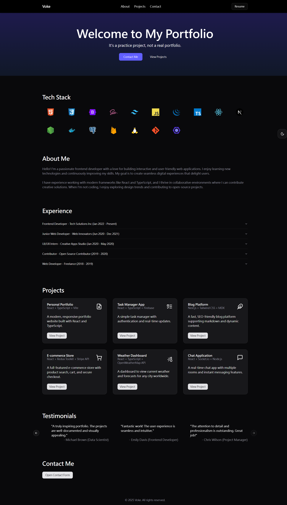
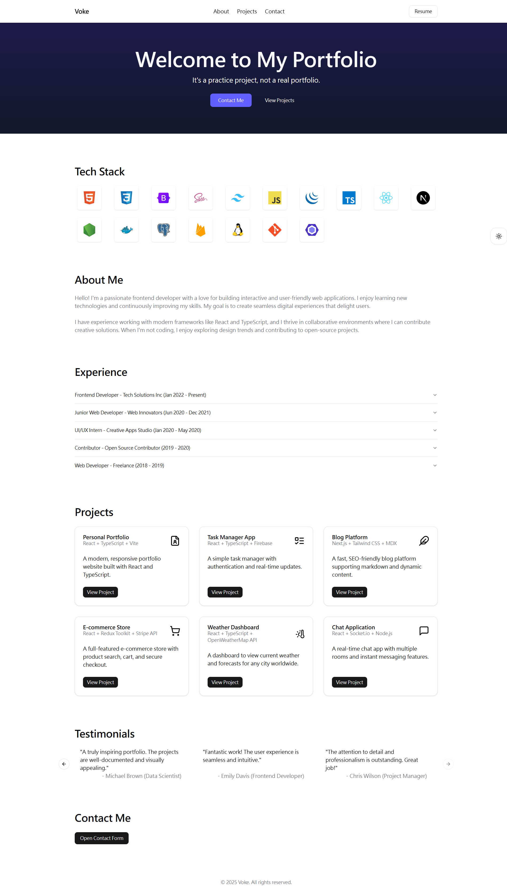

# Personal Portfolio UI

> w/ Tailwind | ShadCN | TS

## Practice Focus

- Tailwind layout (flex/grid), spacing, colors, responsive design.
- Use ShadCN components (e.g., buttons, cards, modal).
- Understand how ShadCN uses Radix under the hood.

## Section

| Section      | Tailwind Focus           | ShadCN Focus    |
| ------------ | ------------------------ | --------------- |
| Header       | Layout, spacing, RWD     | Buttons         |
| Hero         | Typography, spacing, RWD | Buttons         |
| About        | —                        | —               |
| Tech Stack   | Grid, hover transitions  | Tooltip         |
| Experience   | Layout, typography       | Accordion       |
| Projects     | Grid, responsive columns | Cards           |
| Testimonials | Typography, layout       | Carousel        |
| Contact      | Form spacing, validation | Dialog, Buttons |
| Footer       | —                        | —               |

## Preview

  
  

